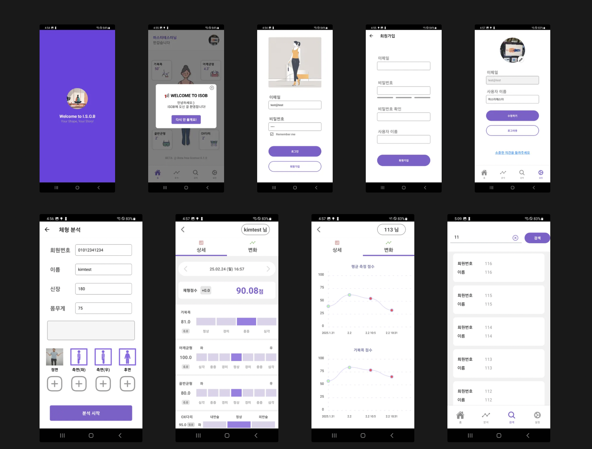

## [아이솝 - AI 자세 분석 앱](https://github.com/kimyk0120/Introducing-ISOB)
ISOB는 스마트폰을 활용한 자세 분석 애플리케이션입니다. AI 기반 인체 인식과 의학적 알고리즘을 통해 자세를 정밀 분석하고, 시계열 데이터 및 그래프로 변화 추적이 가능합니다. 또한, 분석 결과 관리 기능을 제공해 체계적인 건강 관리를 돕습니다. 🚀

### STACKS
- 프론트엔드: React Native
- 백엔드: Java, Spring Boot, JPA, Swagger, JWT, Security, QueryDSL, Lombok
- 데이터베이스: MariaDB
- UI: Figma
- 협업 도구: Jira
- CI/CD : Github Action
- Cloud : Oracle Cloud

## [기타 튜너 앱](https://github.com/kimyk0120/Guitar-Tuner-App)
기타 튜너 앱은 실시간 오디오 분석을 통해 기타의 음정을 맞춰주는 간단하고 직관적인 앱입니다. 🎸

### 기능
- **실시간 주파수 감지** ⚡  
  실시간 오디오 분석으로 기타의 각 줄의 주파수를 정확하게 감지합니다.
- **사용자 친화적 인터페이스** 🖥️  
  직관적인 UI 디자인으로 누구나 쉽게 사용할 수 있습니다.
- **다양한 튜닝 모드 지원** 🔄  
  스탠다드, 드롭 D 등 여러 튜닝 모드를 제공하여 다양한 기타 스타일에 대응합니다.
- **간편한 설치 및 실행** 📲  
  간단한 설치 과정과 빠른 실행으로 즉시 기타 튜닝을 시작할 수 있습니다.
